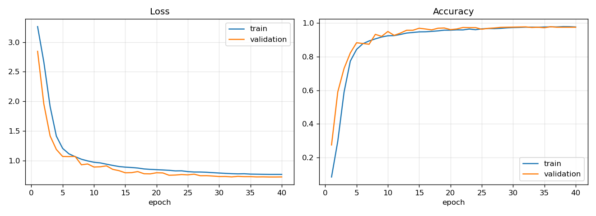
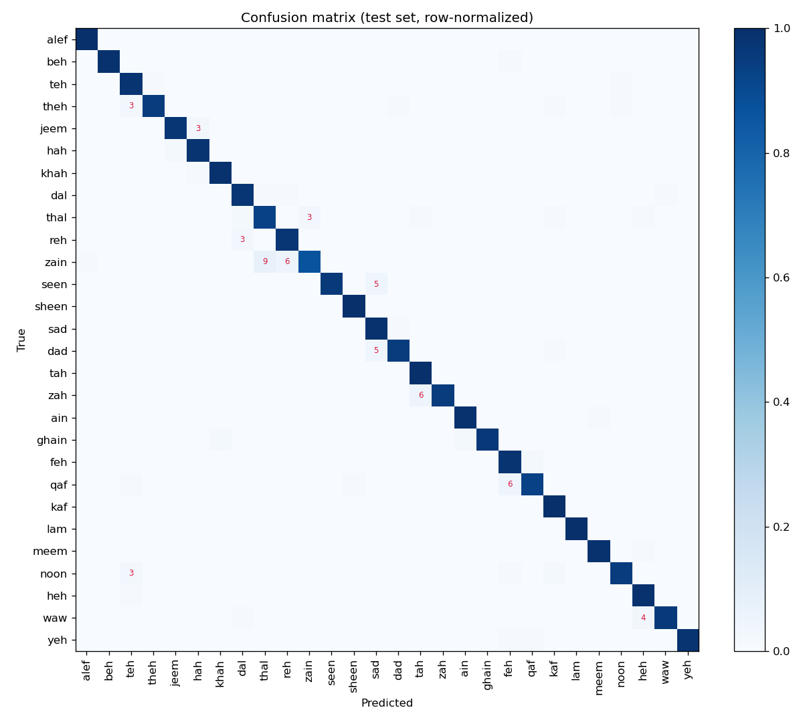
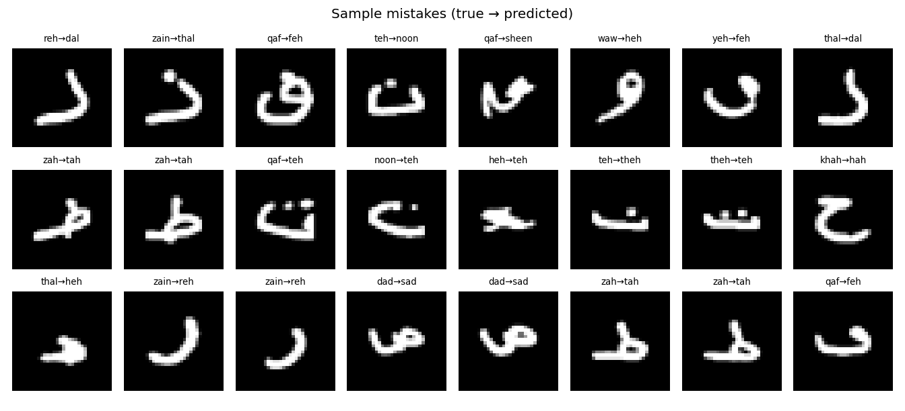

# ✍️ Arabic Handwriting Recognition: a CNN built from scratch in PyTorch

A convolutional neural network that recognizes the **28 handwritten Arabic letters**, written and trained from scratch in PyTorch: custom training loop, GPU-free augmentation, and a live **draw-a-letter** demo.

**Test accuracy: 97.2%** on 3,360 images the model never saw during training (top-3: 99.8%), and **96.7% on simulated canvas drawings**, the kind of input the live demo gets.

> **Live demo:** _coming soon_



## Why it matters

Handwritten Arabic is still common on forms, invoices, cheques, delivery notes and school exams. Character recognition is the core building block of **Arabic OCR** systems that digitize these documents automatically.

## Highlights

- **Model built from scratch:** 3 convolutional blocks (Conv → BatchNorm → ReLU ×2, MaxPool, Dropout) and global average pooling. Only **290K parameters**, so it's fast enough for a CPU or a phone.
- **Custom training loop:** no high-level trainer. It uses AdamW, a OneCycle learning-rate schedule, label smoothing, early stopping and best-checkpoint saving.
- **Data augmentation written in pure PyTorch:** random rotation, scaling, shear and shift in a single batched affine warp (`F.affine_grid` + `F.grid_sample`). No flips, because a mirrored letter is a different letter.
- **Proper evaluation:** a stratified validation split for model selection, the official test set used **once** at the end, a confusion matrix, error analysis, and an end-to-end **canvas simulation** that tests the demo's real input pipeline.
- **Trains on a laptop CPU** in about 20 minutes. No GPU needed.

## Results

| Metric | Value |
|---|---|
| Test accuracy | **97.2%** |
| Top-3 accuracy | 99.8% |
| Simulated canvas drawings (1,000 test letters) | **96.7%** |
| Test images | 3,360 (120 per letter) |
| Parameters | 290,492 |

**Hardest letters:** ز zain (87%), ذ thal (93%), ق qaf (93%), ث theh (95%), ض dad (95%)

**Most confused pairs:** ز→ذ (zain→thal), ظ→ط (zah→tah), ز→ر (zain→reh), ق→ف (qaf→feh), س→ص (seen→sad)

These mistakes make sense: the letters share the same base shape and differ only in **dots** or a small stroke, which are just a few pixels at 32×32. The sample mistakes show that many errors are writing ambiguities, not model failures: some writers left out a dot, which turns ز (zain) into ر (reh) and ض (dad) into ص (sad).

| Confusion matrix | Sample mistakes |
|---|---|
|  |  |

Full metrics: [`results/metrics.json`](results/metrics.json) · Training log: [`results/history.json`](results/history.json)

## Lesson learned: test accuracy isn't enough

The first model was trained on the raw dataset images and reached **98.6%** test accuracy. But when I fed it drawings the way the demo receives them (larger, bolder, positioned anywhere on the canvas), accuracy dropped to **83.6%**. Canvas drawings didn't look like the training images.

**The fix:** one preprocessing function, `normalize_ink()` in `data.py`, now runs on **both** the training images and the user's drawing. It crops the letter, centers it, scales it to a standard ~18 px size, and adjusts the stroke width to ~2 px, whether someone draws small and thin or big and bold.

| Model | Dataset test images | Simulated canvas drawings |
|---|---|---|
| Trained on raw images | 98.6% | 83.6% |
| **Trained with shared preprocessing (final)** | 97.2% | **96.7%** |

The cost: normalizing size and position removes where a letter sits on the writing line, so ز (zain) and ذ (thal) became harder to tell apart. Still, it gives up 1.4 points on the benchmark for a **13-point gain on real-world-style input**, which is the trade-off that matters for a product. `evaluate.py` reproduces the canvas simulation: each test letter is enlarged to a random size, given a random pen thickness, and placed at a random position on a blank canvas.

## Dataset

[Arabic Handwritten Characters Dataset (AHCD)](https://github.com/mloey/Arabic-Handwritten-Characters-Dataset): 16,800 images (32×32, grayscale) of the 28 letters, written by 60 people.

| Split | Images | Used for |
|---|---|---|
| Train | 12,096 | Training |
| Validation | 1,344 | Choosing the best epoch (10% of the official train set, stratified) |
| Test | 3,360 | Final evaluation only |

The dataset has no redistribution license, so it isn't included in this repo. `data.py` downloads it (~3 MB) from the original source on first run.

> El-Sawy, A., Loey, M., & El-Bakry, H. (2017). *Arabic handwritten characters recognition using convolutional neural network.* WSEAS Transactions on Computer Research, 5, 11–19.

## Run it

```bash
pip install -r requirements.txt
python train.py      # downloads the data (~3 MB), trains, saves models/best.pt (~20 min on CPU)
python evaluate.py   # test accuracy, confusion matrix, mistakes
python app.py        # draw-a-letter demo at http://localhost:7860
pytest               # unit tests
```

A trained model (`models/best.pt`, ~1 MB) is included, so `app.py` and `evaluate.py` work without training.

> **Windows + Anaconda:** if you see `OMP: Error #15 ... libiomp5md.dll`, run `set KMP_DUPLICATE_LIB_OK=TRUE` first. It's a known conflict between Anaconda's numpy and PyTorch.

## Project structure

```
├── data.py       # download, loading, augmentation, canvas preprocessing
├── model.py      # the CNN
├── train.py      # training loop, early stopping, training curves
├── evaluate.py   # test metrics, confusion matrix, error analysis
├── app.py        # Gradio draw-a-letter demo
├── models/best.pt
├── results/      # metrics and plots
└── tests/
```

## Limitations and next steps

- It recognizes **isolated letters**, not connected words. Full Arabic OCR also needs word segmentation or a sequence model (CNN + LSTM/Transformer with CTC loss).
- All 60 writers were adults; children's or very fast handwriting may be less accurate.
- Next steps: Arabic digits (٠–٩), letter position forms (initial, medial, final), and a word-level model.

## About me

I build AI solutions for businesses, with a focus on **Arabic and English**: chatbots, document processing and custom models.
More projects: [Chat with your PDFs](https://github.com/KirollosMessak/ai-pdf-chat) · [AI Support Ticket Extractor](https://github.com/KirollosMessak/ai-ticket-extractor)

## License

MIT (code). The dataset belongs to its authors.
